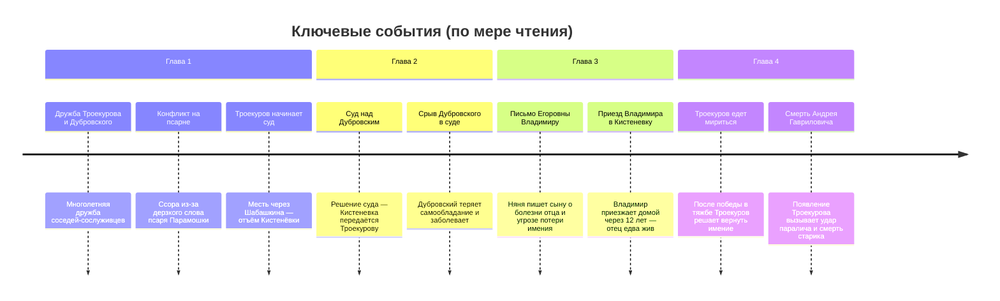

# Дубровский

**Автор:** Александр Пушкин

## Карта книги

См. [[Карта.canvas|карту книги]] — главные герои, места и ключевые события (обновляется по мере чтения).

## Прогресс

- Прочитано до главы: `= this.read_through`
- Начали: `= this.started_on`

## Главы

```dataview
TABLE number AS "№", title AS "Название", read_on AS "Прочитано"
FROM "Книги/Дубровский - Пушкин/Главы"
WHERE type = "chapter"
SORT number ASC
```

## Персонажи

```dataview
TABLE first_appears_in AS "Появился", length(relations) AS "Связей"
FROM "Книги/Дубровский - Пушкин/Персонажи"
WHERE type = "character"
SORT first_appears_in ASC
```

## Места

```dataview
TABLE first_appears_in AS "Появилось"
FROM "Книги/Дубровский - Пушкин/Места"
WHERE type = "location"
SORT first_appears_in ASC
```

## Таймлайн ключевых событий



> Таймлайн обновляется вручную по мере появления новых событий в [[#События]].

    section Глава 5
        Похороны Андрея Гавриловича : Владимир хоронит отца и остаётся один перед бедой
        Приезд суда в Кистеневку : Чиновники пытаются передать людей Троекурову, но Владимир удерживает крестьян от бунта

## События

```dataview
TABLE chapter AS "Глава", location AS "Место", participants AS "Участники"
FROM "Книги/Дубровский - Пушкин/События"
WHERE type = "event"
SORT chapter ASC, order ASC
```
